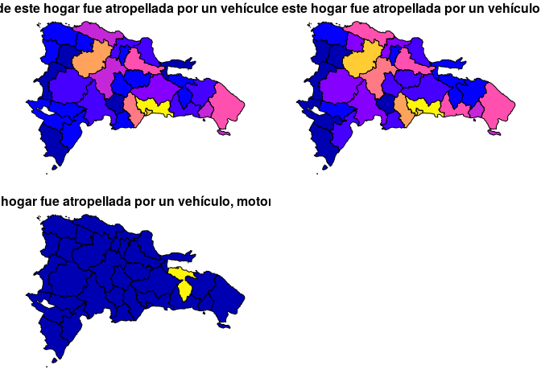
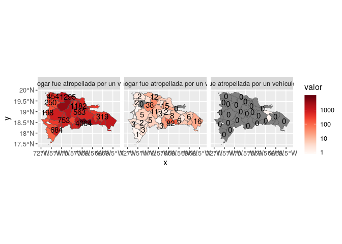
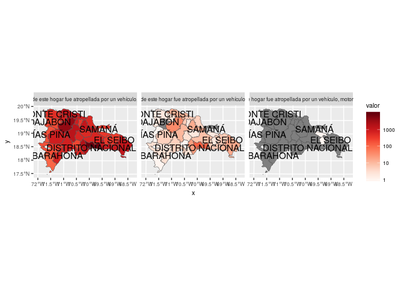
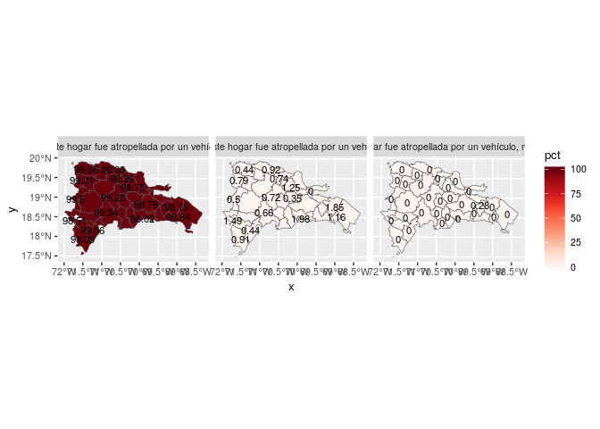
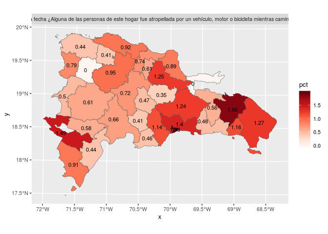
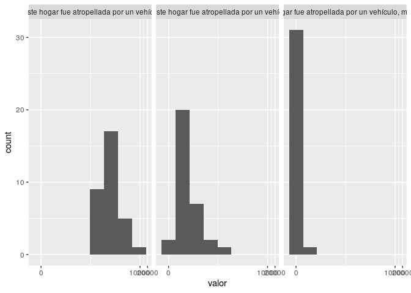
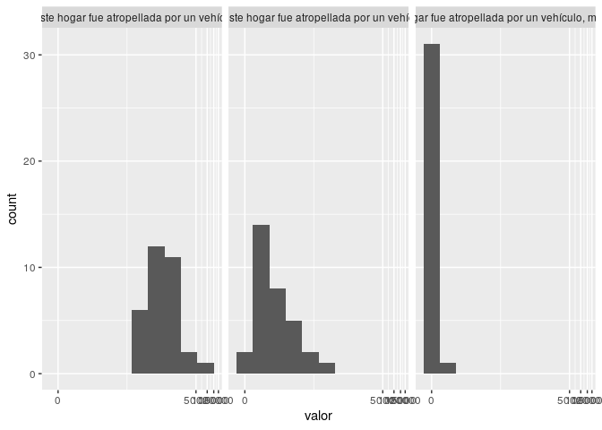
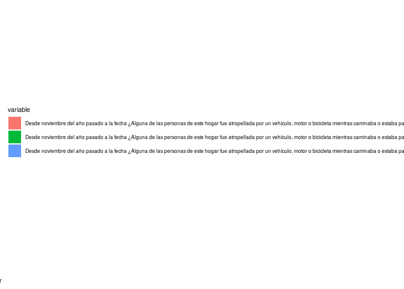

Unidad 2, asignación 1: Análisis exploratorio de datos
======================================================

Dentro de las opciones de `knitr`, en el encabezado de este archivo, es probable que encuentres el argumento `eval = F`. Antes de tejer debes cambiarlo a `eval = T`, para que evalúe los bloques de código según tus cambios.

El objetivo de esta asignación es que te familiarices con técnicas visuales y estadísticas de análisis exploratorio de datos espaciales, usando como referencia la capa de provincias dominicanas y los resultados de la Encuesta Nacional de Hogares de Propósitos Múltiples de 2017 (ENHOGAR-2017, descripción [aquí](https://www.one.gob.do/encuestas/enhogar), datos fuente [aquí](http://redatam.one.gob.do/cgibin/RpWebEngine.exe/PortalAction?&MODE=MAIN&BASE=ENH2017&MAIN=WebServerMain.inl))

Provincia asignada
------------------

Toma nota del código de tu provincia asignada aleatoriamente. Los códigos fueron tomados desde el campo `ENLACE` de la capa `PROVCenso2010` del archivo `data/divisionRD.gpkg`

``` r
 # abreviatura         ENLACE
 #       acade           0405
 #       agrie           0319
 #       aleir           0320
 #       arqco           0517
 #       cindy           0415
 #       franc           0707
 #       geora           0314
 #       hoyod           0616
 #       ingan           0306
 #       ingdi           0603
 #       itac9           0502
 #       ivanv           0808
 #       lbine           0930
 #       leona           0722
 #       magda           0604
 #       maryj           0118
 #       masue           0811
 #       mmvol           0426
 #       naui2           0929
 #       rober           0812
 #       wilne           0228
 #       yoenn           0610
```

Pregunta asignada
-----------------

Toma nota de tu pregunta asignada aleatoriamente. Cada pregunta tiene varias posibles respuestas, todas excluyentes entre sí. Por ejemplo, la pregunta: `A qué cree que se debe la delincuencia en el país: ¿A la falta de lugares para practicar deportes?` tiene las posibles respuestas `Si` (número de hogares que respondieron `Sí`) y `No` (número de hogares que respondieron `No`). Nótese que otras preguntas tienen diferentes posibles respuestas; por ejemplo, `Sexo del jefe(a) del hogar` tiene como posibles respuestas `Hombre`, `Mujer`, `Sin información`. Finalmente, nótese que cada hogar sólo podía responder una de las alternativas.

``` r
#  [1] "acade, Grupo Socio-Económico"                                                                                                                                                            
#  [2] "agrie, Principales problemas de su barrio o comunidad: ¿La educación?"                                                                                                                   
#  [3] "aleir, Principales problemas de su barrio o comunidad: ¿La salud?"                                                                                                                       
#  [4] "arqco, Principales problemas de su barrio o comunidad: ¿La acumulación de basura?"                                                                                                       
#  [5] "cindy, Principales problemas de su barrio o comunidad: ¿La corrupción?"                                                                                                                  
#  [6] "franc, A qué cree que se debe la delincuencia en el país: ¿A la falta de lugares para practicar deportes?"                                                                               
#  [7] "geora, A qué cree que se debe la delincuencia en el país: ¿Otra causa?"                                                                                                                  
#  [8] "hoyod, Principales problemas de su barrio o comunidad: ¿Otro problema?"                                                                                                                  
#  [9] "ingan, A qué cree usted que se debe la delincuencia en su barrio o comunidad: ¿Otra causa?"                                                                                              
# [10] "ingdi, Principales problemas de su barrio o comunidad: ¿El costo de la vida?"                                                                                                            
# [11] "itac9, Sexo del jefe(a) del hogar"                                                                                                                                                       
# [12] "ivanv, Principales problemas de su barrio o comunidad: ¿La delincuencia?"                                                                                                                
# [13] "lbine, Desde noviembre del año pasado hasta la fecha, ¿Alguna de las personas de este hogar tuvo un accidente de tránsito mientra conducía un vehículo, motor o bicicleta?"              
# [14] "leona, Principales problemas de su barrio o comunidad: ¿Calles, aceras y contenes en mal estado?"                                                                                        
# [15] "magda, Desde noviembre del año pasado a la fecha ¿Alguna de las personas de este hogar fue atropellada por un vehículo, motor o bicicleta mientras caminaba o estaba parada en un lugar?"
# [16] "maryj, Principales problemas de su barrio o comunidad: ¿No hay problemas en el barrio o comunidad?"                                                                                      
# [17] "masue, A qué cree usted que se debe la delincuencia en su barrio o comunidad: ¿Educación familiar/falta de valores?"                                                                     
# [18] "mmvol, Principales problemas de su barrio o comunidad: ¿La venta de drogas?"                                                                                                             
# [19] "naui2, A qué cree usted que se debe la delincuencia en su barrio o comunidad: ¿A la falta de oportunidades para estudiar?"                                                               
# [20] "rober, A qué cree usted que se debe la delincuencia en el país: ¿A la venta de drogas?"                                                                                                  
# [21] "wilne, A qué cree que se debe la delincuencia en el país: ¿A la falta de oportunidades para estudiar?"                                                                                   
# [22] "yoenn, A qué cree que se debe la delincuencia en el país: ¿Al consumo de drogas?"
```

Paquetes
--------

-   Carga el paquete `sf` y la colección `tidyverse`.

``` r
library(sf)
## Linking to GEOS 3.7.1, GDAL 2.4.2, PROJ 5.2.0
library(tidyverse)
## ── Attaching packages ──────────────────────────────────────────────────────── tidyverse 1.2.1 ──
## ✔ ggplot2 3.2.1     ✔ purrr   0.3.3
## ✔ tibble  2.1.3     ✔ dplyr   0.8.3
## ✔ tidyr   1.0.0     ✔ stringr 1.4.0
## ✔ readr   1.3.1     ✔ forcats 0.4.0
## ── Conflicts ─────────────────────────────────────────────────────────── tidyverse_conflicts() ──
## ✖ dplyr::filter() masks stats::filter()
## ✖ dplyr::lag()    masks stats::lag()
```

Datos y unión
-------------

El objetivo de esta sección es que puedas unir dos fuentes: el objeto espacial con los límites de las provincias, y el objeto de atributos de "ENHOGAR 2017".

-   Carga el conjunto de datos de "ENHOGAR 2017", asignándolo al objeto `en17`. Este conjunto de datos está guardado como archivo `.csv` en la carpeta `data` (único de su tipo en la carpeta).

``` r
en17 <- read.csv('data/enhogar_2017.csv', check.names = F)
```

> El argumento `check.names = F` hace que la función `read.csv` respete los espacios y caracteres especiales en los nombres de columnas.

-   Carga la capa de provincias con la función `st_read`, asignándola al objeto `prov`.

``` r
prov <- st_read(dsn = 'data/divisionRD.gpkg', layer = 'PROVCenso2010')
## Reading layer `PROVCenso2010' from data source `/home/magda/unidad-2-asignacion-1-esda-operaciones-con-atributos-plots-magdalenaviloriac/data/divisionRD.gpkg' using driver `GPKG'
## Simple feature collection with 32 features and 4 fields
## geometry type:  MULTIPOLYGON
## dimension:      XY
## bbox:           xmin: 182215.8 ymin: 1933532 xmax: 571365.3 ymax: 2205216
## epsg (SRID):    32619
## proj4string:    +proj=utm +zone=19 +datum=WGS84 +units=m +no_defs
```

-   Imprime los nombres de columnas de `en17` (recuerda, el nombre de un objeto en R no se rodea de comillas; las comillas sólo se usan para cadenas de caracteres)

``` r
colnames(en17)
##  [1] "Código"                                                                                                                                                                                                          
##  [2] "Provincia"                                                                                                                                                                                                       
##  [3] "Principales problemas de su barrio o comunidad: ¿La falta de energía eléctrica?: Si"                                                                                                                             
##  [4] "Principales problemas de su barrio o comunidad: ¿La falta de energía eléctrica?: No"                                                                                                                             
##  [5] "Principales problemas de su barrio o comunidad: ¿La delincuencia?: Si"                                                                                                                                           
##  [6] "Principales problemas de su barrio o comunidad: ¿La delincuencia?: No"                                                                                                                                           
##  [7] "Principales problemas de su barrio o comunidad: ¿El desempleo?: Si"                                                                                                                                              
##  [8] "Principales problemas de su barrio o comunidad: ¿El desempleo?: No"                                                                                                                                              
##  [9] "Principales problemas de su barrio o comunidad: ¿La pobreza?: Si"                                                                                                                                                
## [10] "Principales problemas de su barrio o comunidad: ¿La pobreza?: No"                                                                                                                                                
## [11] "Principales problemas de su barrio o comunidad: ¿El consumo de drogas?: Si"                                                                                                                                      
## [12] "Principales problemas de su barrio o comunidad: ¿El consumo de drogas?: No"                                                                                                                                      
## [13] "Principales problemas de su barrio o comunidad: ¿La venta de drogas?: Si"                                                                                                                                        
## [14] "Principales problemas de su barrio o comunidad: ¿La venta de drogas?: No"                                                                                                                                        
## [15] "Principales problemas de su barrio o comunidad: ¿El costo de la vida?: Si"                                                                                                                                       
## [16] "Principales problemas de su barrio o comunidad: ¿El costo de la vida?: No"                                                                                                                                       
## [17] "Principales problemas de su barrio o comunidad: ¿La corrupción?: Si"                                                                                                                                             
## [18] "Principales problemas de su barrio o comunidad: ¿La corrupción?: No"                                                                                                                                             
## [19] "Principales problemas de su barrio o comunidad: ¿La educación?: Si"                                                                                                                                              
## [20] "Principales problemas de su barrio o comunidad: ¿La educación?: No"                                                                                                                                              
## [21] "Principales problemas de su barrio o comunidad: ¿La salud?: Si"                                                                                                                                                  
## [22] "Principales problemas de su barrio o comunidad: ¿La salud?: No"                                                                                                                                                  
## [23] "Principales problemas de su barrio o comunidad: ¿La falta de agua?: Si"                                                                                                                                          
## [24] "Principales problemas de su barrio o comunidad: ¿La falta de agua?: No"                                                                                                                                          
## [25] "Principales problemas de su barrio o comunidad: ¿La acumulación de basura?: Si"                                                                                                                                  
## [26] "Principales problemas de su barrio o comunidad: ¿La acumulación de basura?: No"                                                                                                                                  
## [27] "Principales problemas de su barrio o comunidad: ¿Calles, aceras y contenes en mal estado?: Si"                                                                                                                   
## [28] "Principales problemas de su barrio o comunidad: ¿Calles, aceras y contenes en mal estado?: No"                                                                                                                   
## [29] "Principales problemas de su barrio o comunidad: ¿No hay problemas en el barrio o comunidad?: Si"                                                                                                                 
## [30] "Principales problemas de su barrio o comunidad: ¿No hay problemas en el barrio o comunidad?: No"                                                                                                                 
## [31] "Principales problemas de su barrio o comunidad: ¿Otro problema?: Si"                                                                                                                                             
## [32] "Principales problemas de su barrio o comunidad: ¿Otro problema?: No"                                                                                                                                             
## [33] "A qué cree que se debe la delincuencia en el país: ¿Al desempleo?: Si"                                                                                                                                           
## [34] "A qué cree que se debe la delincuencia en el país: ¿Al desempleo?: No"                                                                                                                                           
## [35] "A qué cree que se debe la delincuencia en el país: ¿A la pobreza?: Si"                                                                                                                                           
## [36] "A qué cree que se debe la delincuencia en el país: ¿A la pobreza?: No"                                                                                                                                           
## [37] "A qué cree que se debe la delincuencia en el país: ¿A la falta de oportunidades para estudiar?: Si"                                                                                                              
## [38] "A qué cree que se debe la delincuencia en el país: ¿A la falta de oportunidades para estudiar?: No"                                                                                                              
## [39] "A qué cree que se debe la delincuencia en el país: ¿A la falta de lugares para practicar deportes?: Si"                                                                                                          
## [40] "A qué cree que se debe la delincuencia en el país: ¿A la falta de lugares para practicar deportes?: No"                                                                                                          
## [41] "A qué cree que se debe la delincuencia en el país: ¿A la falta de alternativas sanas (clubes, cine, teatro, etc.) para el entretenimiento?: Si"                                                                  
## [42] "A qué cree que se debe la delincuencia en el país: ¿A la falta de alternativas sanas (clubes, cine, teatro, etc.) para el entretenimiento?: No"                                                                  
## [43] "A qué cree que se debe la delincuencia en el país: ¿Al consumo de drogas?: Si"                                                                                                                                   
## [44] "A qué cree que se debe la delincuencia en el país: ¿Al consumo de drogas?: No"                                                                                                                                   
## [45] "A qué cree usted que se debe la delincuencia en el país: ¿A la venta de drogas?: Si"                                                                                                                             
## [46] "A qué cree usted que se debe la delincuencia en el país: ¿A la venta de drogas?: No"                                                                                                                             
## [47] "A qué cree que se debe la delincuencia en el país: ¿Descomposición del hogar o mala crianza?: Si"                                                                                                                
## [48] "A qué cree que se debe la delincuencia en el país: ¿Descomposición del hogar o mala crianza?: No"                                                                                                                
## [49] "A qué cree que se debe la delincuencia en el país: ¿Otra causa?: Si"                                                                                                                                             
## [50] "A qué cree que se debe la delincuencia en el país: ¿Otra causa?: No"                                                                                                                                             
## [51] "A qué cree usted que se debe la delincuencia en su barrio o comunidad: ¿Al desempleo?: Si"                                                                                                                       
## [52] "A qué cree usted que se debe la delincuencia en su barrio o comunidad: ¿Al desempleo?: No"                                                                                                                       
## [53] "A qué cree usted que se debe la delincuencia en su barrio o comunidad: ¿A la pobreza?: Si"                                                                                                                       
## [54] "A qué cree usted que se debe la delincuencia en su barrio o comunidad: ¿A la pobreza?: No"                                                                                                                       
## [55] "A qué cree usted que se debe la delincuencia en su barrio o comunidad: ¿A la falta de oportunidades para estudiar?: Si"                                                                                          
## [56] "A qué cree usted que se debe la delincuencia en su barrio o comunidad: ¿A la falta de oportunidades para estudiar?: No"                                                                                          
## [57] "A qué cree usted que se debe la delincuencia en su barrio o comunidad: ¿A la falta de lugares para practicar deportes?: Si"                                                                                      
## [58] "A qué cree usted que se debe la delincuencia en su barrio o comunidad: ¿A la falta de lugares para practicar deportes?: No"                                                                                      
## [59] "A qué cree usted que se debe la delincuencia en su barrio o comunidad: ¿A la falta de alternativas sanas (clubes, cine, teatro, etc.) para el entretenimiento?: Si"                                              
## [60] "A qué cree usted que se debe la delincuencia en su barrio o comunidad: ¿A la falta de alternativas sanas (clubes, cine, teatro, etc.) para el entretenimiento?: No"                                              
## [61] "A qué cree usted que se debe la delincuencia en su barrio o comunidad: ¿Al consumo de drogas?: Si"                                                                                                               
## [62] "A qué cree usted que se debe la delincuencia en su barrio o comunidad: ¿Al consumo de drogas?: No"                                                                                                               
## [63] "A qué cree usted que se debe la delincuencia en su barrio o comunidad: ¿A la venta de drogas?: Si"                                                                                                               
## [64] "A qué cree usted que se debe la delincuencia en su barrio o comunidad: ¿A la venta de drogas?: No"                                                                                                               
## [65] "A qué cree usted que se debe la delincuencia en su barrio o comunidad: ¿Falta de educación?: Si"                                                                                                                 
## [66] "A qué cree usted que se debe la delincuencia en su barrio o comunidad: ¿Falta de educación?: No"                                                                                                                 
## [67] "A qué cree usted que se debe la delincuencia en su barrio o comunidad: ¿Falta de autoridad?: Si"                                                                                                                 
## [68] "A qué cree usted que se debe la delincuencia en su barrio o comunidad: ¿Falta de autoridad?: No"                                                                                                                 
## [69] "A qué cree usted que se debe la delincuencia en su barrio o comunidad: ¿Educación familiar/falta de valores?: Si"                                                                                                
## [70] "A qué cree usted que se debe la delincuencia en su barrio o comunidad: ¿Educación familiar/falta de valores?: No"                                                                                                
## [71] "A qué cree usted que se debe la delincuencia en su barrio o comunidad: ¿No hay delincuencia en su barrio o comunidad?: Si"                                                                                       
## [72] "A qué cree usted que se debe la delincuencia en su barrio o comunidad: ¿No hay delincuencia en su barrio o comunidad?: No"                                                                                       
## [73] "A qué cree usted que se debe la delincuencia en su barrio o comunidad: ¿Otra causa?: Si"                                                                                                                         
## [74] "A qué cree usted que se debe la delincuencia en su barrio o comunidad: ¿Otra causa?: No"                                                                                                                         
## [75] "Desde noviembre del año pasado hasta la fecha, ¿Alguna de las personas de este hogar tuvo un accidente de tránsito mientra conducía un vehículo, motor o bicicleta?: Si"                                         
## [76] "Desde noviembre del año pasado hasta la fecha, ¿Alguna de las personas de este hogar tuvo un accidente de tránsito mientra conducía un vehículo, motor o bicicleta?: No"                                         
## [77] "Desde noviembre del año pasado hasta la fecha ¿Alguna de las personas de este hogar tuvo un accidente de tránsito mientras iba en un vehículo de motor o bicicleta, conducido por otra persona?: Si"             
## [78] "Desde noviembre del año pasado hasta la fecha ¿Alguna de las personas de este hogar tuvo un accidente de tránsito mientras iba en un vehículo de motor o bicicleta, conducido por otra persona?: No"             
## [79] "Desde noviembre del año pasado hasta la fecha ¿Alguna de las personas de este hogar tuvo un accidente de tránsito mientras iba en un vehículo de motor o bicicleta, conducido por otra persona?: Sin información"
## [80] "Desde noviembre del año pasado a la fecha ¿Alguna de las personas de este hogar fue atropellada por un vehículo, motor o bicicleta mientras caminaba o estaba parada en un lugar?: Si"                           
## [81] "Desde noviembre del año pasado a la fecha ¿Alguna de las personas de este hogar fue atropellada por un vehículo, motor o bicicleta mientras caminaba o estaba parada en un lugar?: No"                           
## [82] "Desde noviembre del año pasado a la fecha ¿Alguna de las personas de este hogar fue atropellada por un vehículo, motor o bicicleta mientras caminaba o estaba parada en un lugar?: Sin información"              
## [83] "Cuántas personas de este hogar han tenido algún accidente de tránsito desde noviembre del año pasado hasta la fecha?: 0"                                                                                         
## [84] "Cuántas personas de este hogar han tenido algún accidente de tránsito desde noviembre del año pasado hasta la fecha?: 1"                                                                                         
## [85] "Cuántas personas de este hogar han tenido algún accidente de tránsito desde noviembre del año pasado hasta la fecha?: 2"                                                                                         
## [86] "Cuántas personas de este hogar han tenido algún accidente de tránsito desde noviembre del año pasado hasta la fecha?: 3"                                                                                         
## [87] "Cuántas personas de este hogar han tenido algún accidente de tránsito desde noviembre del año pasado hasta la fecha?: 4"                                                                                         
## [88] "Sexo del jefe(a) del hogar: Hombre"                                                                                                                                                                              
## [89] "Sexo del jefe(a) del hogar: Mujer"                                                                                                                                                                               
## [90] "Sexo del jefe(a) del hogar: Sin información"                                                                                                                                                                     
## [91] "Tipo de hogar: Unipersonal"                                                                                                                                                                                      
## [92] "Tipo de hogar: Nuclear"                                                                                                                                                                                          
## [93] "Tipo de hogar: Extendido"                                                                                                                                                                                        
## [94] "Tipo de hogar: Compuesto"                                                                                                                                                                                        
## [95] "Grupo Socio-Económico: Muy bajo"                                                                                                                                                                                 
## [96] "Grupo Socio-Económico: Bajo"                                                                                                                                                                                     
## [97] "Grupo Socio-Económico: Medio bajo"                                                                                                                                                                               
## [98] "Grupo Socio-Económico: Medio"                                                                                                                                                                                    
## [99] "Grupo Socio-Económico: Medio alto-Alto"
```

-   Imprime los nombres de columnas de `prov`

``` r
colnames(prov)
## [1] "PROV"      "REG"       "TOPONIMIA" "ENLACE"    "geom"
```

-   Las columnas a través de las cuales se pueden unir ambos conjuntos son `en17$Código` y `prov$ENLACE`. Sin embargo, al igual que ocurría con los datos del censo en el material de apoyo, la columna `en17$Código` no conserva los ceros a la izquierda. En este caso, dicha omisión ocurre en los códigos con 3 caracteres (los que tienen 4 caracteres están correctos). Visualiza ambas columnas para que notes la discrepancia.

``` r
en17$Código
##  [1]  109  118  125  213  224  228  306  314  319  320  405  415  426  427
## [15]  502  517  521  531  603  604  610  616  707  722  808  811  812  923
## [29]  929  930 1001 1032
prov$ENLACE
##  [1] 1001 0502 0603 0604 0405 0306 0707 0808 0109 0610 0811 0812 0213 0314
## [15] 0415 0616 0517 0118 0319 0320 0521 0722 0923 0224 0125 0426 0427 0228
## [29] 0929 0930 0531 1032
## 32 Levels: 0109 0118 0125 0213 0224 0228 0306 0314 0319 0320 0405 ... 1032
```

-   Si intentaras hacer una unión, no daría resultados apropiados. Para comprobarlo que dicha unión fallaría, utiliza la función `match`.

``` r
match(en17$Código , prov$ENLACE)
##  [1] NA NA NA NA NA NA NA NA NA NA NA NA NA NA NA NA NA NA NA NA NA NA NA
## [24] NA NA NA NA NA NA NA  1 32
```

-   Para resolver esta discrepancia, crea una columna en el objeto `en17`, mediante la cual unirás este objeto con `prov`. Es preferible que las columnas con las que se realizará la unión tengan el mismo nombre. El objeto `prov` ya tiene una columna `ENLACE` con códigos correctos, razón por la cual crearás una columna denominada `ENLACE` en `en17`, corrigiendo al mismo tiempo los ceros a la izquierda faltantes. Una forma de las formas más cómodas de resolverlo es con la función `mutate`, creando una columna nueva a partir de la columna `Código`. Para que la nueva columna contenga los ceros a la izquierda faltantes, utiliza la función de condición `ifelse`. Utiliza el material de apoyo como referencia.

``` r
en17 <- en17 %>% mutate(ENLACE = ifelse(nchar(Código)==3, paste0('0',Código ), Código))
```

-   Imprime en pantalla la columna `ENLACE` creada en `en17`, e intenta ahora el `match` entre ambas columnas `ENLACE` de los dos objetos, `en17` y `prov`. Si tras ejecutar el `match` no aparecen `NA`, entonces la unión puede realizarse sin problemas.

``` r
en17$ENLACE
##  [1] "0109" "0118" "0125" "0213" "0224" "0228" "0306" "0314" "0319" "0320"
## [11] "0405" "0415" "0426" "0427" "0502" "0517" "0521" "0531" "0603" "0604"
## [21] "0610" "0616" "0707" "0722" "0808" "0811" "0812" "0923" "0929" "0930"
## [31] "1001" "1032"
match(en17$ENLACE , prov$ENLACE)
##  [1]  9 18 25 13 24 28  6 14 19 20  5 15 26 27  2 17 21 31  3  4 10 16  7
## [24] 22  8 11 12 23 29 30  1 32
```

-   Ahora haz la unión entre los conjuntos de datos `en17` y `prov` mediante la función `inner_join` usando el campo `ENLACE`, el cual existe en ambos objetos de manera consistente, siempre que hayas ejecutado bien los códigos anteriores. Asigna el resultado al objeto `proven17`, e imprímelo en pantalla.

``` r
proven17 <- prov %>% inner_join(en17, by = 'ENLACE')
## Warning: Column `ENLACE` joining factor and character vector, coercing into
## character vector
class(proven17)
## [1] "sf"         "data.frame"
```

-   Genera un mapa con los resultados de tu pregunta para todo el país, usando la función `plot`.

> Un ejemplo ilustra cómo hacerlo. Supongamos el caso del estudiante ficticio `hoyod`. Para extraer su pregunta, el `hoyod` utiliza el operador `%>%`, la función `dplyr::select` y la función `contains`. Nota que este bloque de código de ejemplo, y los siguientes del alumno ficticio, están marcados como `eval=F`, para así evitar que generen resultados.

``` r
proven17 %>%
  dplyr::select(contains('Principales problemas de su barrio o comunidad: ¿Otro problema?')) %>%
  plot(breaks = 'jenks')
```

**Tu turno**

``` r
proven17 %>%
  dplyr::select(contains('Desde noviembre del año pasado a la fecha ¿Alguna de las personas de este hogar fue atropellada por un vehículo, motor o bicicleta mientras caminaba o estaba parada en un lugar?')) %>%
  plot(breaks = 'jenks')
```



-   Genera un mapa con los resultados de tu pregunta para todo el país, usando la función `geom_sf` del paquete `ggplot2`, colocando como rótulos los valores de cada provincia. Genera otro mapa colocando los nombres de las provincias.

> El ejemplo del estudiante `hoyod` ilustra cómo hacerlo. Observa tres detalles:

> -   La paleta utilizada es `brewer.pal` del paquete `RColorBrewer`, define gradientes apropiados para la representación. Si escribe en la consola `RColorBrewer::display.brewer.all()`, se desplegarán todas las posibles paletas del paquete.
> -   Puedes definir el tamaño de la letra de los mapas. En el ejemplo, verás que se configuran dos tipos de letra mediante `size`: 1) La letra de los títulos de cada gráfico y la leyenda, en `theme(text = element_text(size = X))`; 2) Los rótulos de mapa en `geom_sf_text(size, size = X)`.
> -   La tabla de visulización de colores para el relleno usa escala logarítmica, y la define el argumento `trans = 'log10'`. Puedes "jugar" quitando dicho argumento, y notarás que los patrones se esconden, o que las provincias que destacan son sólo aquellas con valores extremos.

``` r
#Rótulos: valor de la variable
proven17 %>%
  dplyr::select(contains('Principales problemas de su barrio o comunidad: ¿Otro problema?')) %>%
  gather(variable, valor, -geom) %>% 
  ggplot() + aes(fill = valor) + geom_sf(lwd = 0.2) +
  facet_wrap(~variable) + theme(text = element_text(size = 10)) +
  scale_fill_gradientn(colours = RColorBrewer::brewer.pal(9, name = 'Reds'), trans = 'log10') +
  geom_sf_text(aes(label=valor), check_overlap = T, size = 3)

#Rótulos: nombres de las provincias
proven17 %>%
  dplyr::select(contains('Principales problemas de su barrio o comunidad: ¿Otro problema?'), TOPONIMIA) %>%
  gather(variable, valor, -geom, -TOPONIMIA) %>% 
  ggplot() + aes(fill = valor) + geom_sf(lwd = 0.2) +
  facet_wrap(~variable) + theme(text = element_text(size = 10)) +
  scale_fill_gradientn(colours = RColorBrewer::brewer.pal(9, name = 'Reds'), trans = 'log10') +
  geom_sf_text(aes(label=TOPONIMIA), check_overlap = T, size = 3)
```

**Tu turno**

``` r
#Rótulos: valor de la variable
proven17 %>%
  dplyr::select(contains('Desde noviembre del año pasado a la fecha ¿Alguna de las personas de este hogar fue atropellada por un vehículo, motor o bicicleta mientras caminaba o estaba parada en un lugar?')) %>%
  gather(variable, valor, -geom) %>% 
  ggplot() + aes(fill = valor) + geom_sf(lwd = 0.2) +
  facet_wrap(~variable) + theme(text = element_text(size = 12)) +
  scale_fill_gradientn(colours = RColorBrewer::brewer.pal(9, name = 'Reds'), trans = 'log10') +
  geom_sf_text(aes(label=valor), check_overlap = T, size = 4)
## Warning: Transformation introduced infinite values in discrete y-axis

## Warning: Transformation introduced infinite values in discrete y-axis
```



``` r

#Rótulos: nombres de las provincias
proven17%>%
  dplyr::select(contains('Desde noviembre del año pasado a la fecha ¿Alguna de las personas de este hogar fue atropellada por un vehículo, motor o bicicleta mientras caminaba o estaba parada en un lugar?'), TOPONIMIA) %>%
  gather(variable, valor, -geom, -TOPONIMIA) %>% 
  ggplot() + aes(fill = valor) + geom_sf(lwd = 0.2) +
  facet_wrap(~variable) + theme(text = element_text(size = 8)) +
  scale_fill_gradientn(colours = RColorBrewer::brewer.pal(9, name = 'Reds'), trans = 'log10') +
  geom_sf_text(aes(label=TOPONIMIA), check_overlap = T, size = 4)
## Warning: Transformation introduced infinite values in discrete y-axis

## Warning: Transformation introduced infinite values in discrete y-axis
```



-   Imprime una tabla, sin columna geométrica, mostrando las respuestas a tu pregunta para todo el país, incluyendo la columna `TOPONIMIA`.

> Un ejemplo ilustra el caso del estudiante `hoyod`:

``` r
proven17 %>% st_drop_geometry() %>%
  dplyr::select(TOPONIMIA, contains('Principales problemas de su barrio o comunidad: ¿Otro problema?'))
```

**Tu turno**

``` r
proven17 %>% st_drop_geometry() %>%
  dplyr::select(TOPONIMIA, contains('Desde noviembre del año pasado a la fecha ¿Alguna de las personas de este hogar fue atropellada por un vehículo, motor o bicicleta mientras caminaba o estaba parada en un lugar?'))
##                 TOPONIMIA
## 1       DISTRITO NACIONAL
## 2                    AZUA
## 3                 BAORUCO
## 4                BARAHONA
## 5                 DAJABÓN
## 6                  DUARTE
## 7              ELÍAS PIÑA
## 8                EL SEIBO
## 9               ESPAILLAT
## 10          INDEPENDENCIA
## 11          LA ALTAGRACIA
## 12              LA ROMANA
## 13                LA VEGA
## 14 MARÍA TRINIDAD SÁNCHEZ
## 15           MONTE CRISTI
## 16             PEDERNALES
## 17                PERAVIA
## 18           PUERTO PLATA
## 19       HERMANAS MIRABAL
## 20                 SAMANÁ
## 21          SAN CRISTÓBAL
## 22               SAN JUAN
## 23   SAN PEDRO DE MACORÍS
## 24        SANCHEZ RAMÍREZ
## 25               SANTIAGO
## 26     SANTIAGO RODRÍGUEZ
## 27               VALVERDE
## 28         MONSEÑOR NOUEL
## 29            MONTE PLATA
## 30             HATO MAYOR
## 31       SAN JOSÉ DE OCOA
## 32          SANTO DOMINGO
##    Desde noviembre del año pasado a la fecha ¿Alguna de las personas de este hogar fue atropellada por un vehículo, motor o bicicleta mientras caminaba o estaba parada en un lugar?: Si
## 1                                                                                                                                                                                     82
## 2                                                                                                                                                                                      5
## 3                                                                                                                                                                                      2
## 4                                                                                                                                                                                      3
## 5                                                                                                                                                                                      2
## 6                                                                                                                                                                                     15
## 7                                                                                                                                                                                      1
## 8                                                                                                                                                                                      6
## 9                                                                                                                                                                                      6
## 10                                                                                                                                                                                     3
## 11                                                                                                                                                                                    16
## 12                                                                                                                                                                                    12
## 13                                                                                                                                                                                    11
## 14                                                                                                                                                                                     5
## 15                                                                                                                                                                                     2
## 16                                                                                                                                                                                     1
## 17                                                                                                                                                                                     3
## 18                                                                                                                                                                                    12
## 19                                                                                                                                                                                     2
## 20                                                                                                                                                                                     0
## 21                                                                                                                                                                                    22
## 22                                                                                                                                                                                     5
## 23                                                                                                                                                                                     6
## 24                                                                                                                                                                                     2
## 25                                                                                                                                                                                    38
## 26                                                                                                                                                                                     0
## 27                                                                                                                                                                                     3
## 28                                                                                                                                                                                     3
## 29                                                                                                                                                                                     8
## 30                                                                                                                                                                                     2
## 31                                                                                                                                                                                     1
## 32                                                                                                                                                                                   128
##    Desde noviembre del año pasado a la fecha ¿Alguna de las personas de este hogar fue atropellada por un vehículo, motor o bicicleta mientras caminaba o estaba parada en un lugar?: No
## 1                                                                                                                                                                                   4064
## 2                                                                                                                                                                                    753
## 3                                                                                                                                                                                    341
## 4                                                                                                                                                                                    684
## 5                                                                                                                                                                                    250
## 6                                                                                                                                                                                   1182
## 7                                                                                                                                                                                    198
## 8                                                                                                                                                                                    319
## 9                                                                                                                                                                                    809
## 10                                                                                                                                                                                   198
## 11                                                                                                                                                                                  1242
## 12                                                                                                                                                                                  1021
## 13                                                                                                                                                                                  1511
## 14                                                                                                                                                                                   559
## 15                                                                                                                                                                                   454
## 16                                                                                                                                                                                   109
## 17                                                                                                                                                                                   644
## 18                                                                                                                                                                                  1295
## 19                                                                                                                                                                                   324
## 20                                                                                                                                                                                   373
## 21                                                                                                                                                                                  1908
## 22                                                                                                                                                                                   813
## 23                                                                                                                                                                                  1249
## 24                                                                                                                                                                                   563
## 25                                                                                                                                                                                  3983
## 26                                                                                                                                                                                   226
## 27                                                                                                                                                                                   727
## 28                                                                                                                                                                                   637
## 29                                                                                                                                                                                   638
## 30                                                                                                                                                                                   357
## 31                                                                                                                                                                                   241
## 32                                                                                                                                                                                  9018
##    Desde noviembre del año pasado a la fecha ¿Alguna de las personas de este hogar fue atropellada por un vehículo, motor o bicicleta mientras caminaba o estaba parada en un lugar?: Sin información
## 1                                                                                                                                                                                                   0
## 2                                                                                                                                                                                                   0
## 3                                                                                                                                                                                                   0
## 4                                                                                                                                                                                                   0
## 5                                                                                                                                                                                                   0
## 6                                                                                                                                                                                                   0
## 7                                                                                                                                                                                                   0
## 8                                                                                                                                                                                                   0
## 9                                                                                                                                                                                                   0
## 10                                                                                                                                                                                                  0
## 11                                                                                                                                                                                                  0
## 12                                                                                                                                                                                                  0
## 13                                                                                                                                                                                                  0
## 14                                                                                                                                                                                                  0
## 15                                                                                                                                                                                                  0
## 16                                                                                                                                                                                                  0
## 17                                                                                                                                                                                                  0
## 18                                                                                                                                                                                                  0
## 19                                                                                                                                                                                                  0
## 20                                                                                                                                                                                                  0
## 21                                                                                                                                                                                                  0
## 22                                                                                                                                                                                                  0
## 23                                                                                                                                                                                                  0
## 24                                                                                                                                                                                                  0
## 25                                                                                                                                                                                                  0
## 26                                                                                                                                                                                                  0
## 27                                                                                                                                                                                                  0
## 28                                                                                                                                                                                                  0
## 29                                                                                                                                                                                                  0
## 30                                                                                                                                                                                                  1
## 31                                                                                                                                                                                                  0
## 32                                                                                                                                                                                                  0
```

-   Imprime una tabla, sin columna geométrica, mostrando los porcentajes de cada respuesta a tu pregunta para todo el país, incluyendo la columna `TOPONIMIA` y relativizando las respuestas para cada provincia.

> Un ejemplo ilustra el caso del estudiante `hoyod`. Tres operaciones son clave en este proceso: 1) `gather` que reúne sólo las columnas numéricas, sin la de nombres de provincias (por eso verás `-TOPONIMIA`). 2) Las funciones `mutate` y `spread`, la primera genera el porcentaje por provincias, y la segunda distribuye los datos por columnas. 3) La función `kable`, del paquete `kableExtra`, genera una tabla en formato HTML, más organizada y legible que el resultado que devuelve la consola.

``` r
proven17 %>% st_drop_geometry() %>%
  dplyr::select(TOPONIMIA, contains('Principales problemas de su barrio o comunidad: ¿Otro problema?')) %>% 
  gather(variable, valor, -TOPONIMIA) %>% group_by(TOPONIMIA) %>%
  mutate(pct=round(valor/sum(valor)*100,2)) %>% dplyr::select(-valor) %>%
  spread(variable, pct) %>% kableExtra::kable()
```

**Tu turno**

``` r
proven17%>% st_drop_geometry() %>%
  dplyr::select(TOPONIMIA, contains('Desde noviembre del año pasado a la fecha ¿Alguna de las personas de este hogar fue atropellada por un vehículo, motor o bicicleta mientras caminaba o estaba parada en un lugar?')) %>% 
  gather(variable, valor, -TOPONIMIA) %>% group_by(TOPONIMIA) %>%
  mutate(pct=round(valor/sum(valor)*100,2)) %>% dplyr::select(-valor) %>%
  spread(variable, pct) %>% kableExtra::kable()
```

<table>
<thead>
<tr>
<th style="text-align:left;">
TOPONIMIA
</th>
<th style="text-align:right;">
Desde noviembre del año pasado a la fecha ¿Alguna de las personas de este hogar fue atropellada por un vehículo, motor o bicicleta mientras caminaba o estaba parada en un lugar?: No
</th>
<th style="text-align:right;">
Desde noviembre del año pasado a la fecha ¿Alguna de las personas de este hogar fue atropellada por un vehículo, motor o bicicleta mientras caminaba o estaba parada en un lugar?: Si
</th>
<th style="text-align:right;">
Desde noviembre del año pasado a la fecha ¿Alguna de las personas de este hogar fue atropellada por un vehículo, motor o bicicleta mientras caminaba o estaba parada en un lugar?: Sin información
</th>
</tr>
</thead>
<tbody>
<tr>
<td style="text-align:left;">
AZUA
</td>
<td style="text-align:right;">
99.34
</td>
<td style="text-align:right;">
0.66
</td>
<td style="text-align:right;">
0.00
</td>
</tr>
<tr>
<td style="text-align:left;">
BAORUCO
</td>
<td style="text-align:right;">
99.42
</td>
<td style="text-align:right;">
0.58
</td>
<td style="text-align:right;">
0.00
</td>
</tr>
<tr>
<td style="text-align:left;">
BARAHONA
</td>
<td style="text-align:right;">
99.56
</td>
<td style="text-align:right;">
0.44
</td>
<td style="text-align:right;">
0.00
</td>
</tr>
<tr>
<td style="text-align:left;">
DAJABÓN
</td>
<td style="text-align:right;">
99.21
</td>
<td style="text-align:right;">
0.79
</td>
<td style="text-align:right;">
0.00
</td>
</tr>
<tr>
<td style="text-align:left;">
DISTRITO NACIONAL
</td>
<td style="text-align:right;">
98.02
</td>
<td style="text-align:right;">
1.98
</td>
<td style="text-align:right;">
0.00
</td>
</tr>
<tr>
<td style="text-align:left;">
DUARTE
</td>
<td style="text-align:right;">
98.75
</td>
<td style="text-align:right;">
1.25
</td>
<td style="text-align:right;">
0.00
</td>
</tr>
<tr>
<td style="text-align:left;">
EL SEIBO
</td>
<td style="text-align:right;">
98.15
</td>
<td style="text-align:right;">
1.85
</td>
<td style="text-align:right;">
0.00
</td>
</tr>
<tr>
<td style="text-align:left;">
ELÍAS PIÑA
</td>
<td style="text-align:right;">
99.50
</td>
<td style="text-align:right;">
0.50
</td>
<td style="text-align:right;">
0.00
</td>
</tr>
<tr>
<td style="text-align:left;">
ESPAILLAT
</td>
<td style="text-align:right;">
99.26
</td>
<td style="text-align:right;">
0.74
</td>
<td style="text-align:right;">
0.00
</td>
</tr>
<tr>
<td style="text-align:left;">
HATO MAYOR
</td>
<td style="text-align:right;">
99.17
</td>
<td style="text-align:right;">
0.56
</td>
<td style="text-align:right;">
0.28
</td>
</tr>
<tr>
<td style="text-align:left;">
HERMANAS MIRABAL
</td>
<td style="text-align:right;">
99.39
</td>
<td style="text-align:right;">
0.61
</td>
<td style="text-align:right;">
0.00
</td>
</tr>
<tr>
<td style="text-align:left;">
INDEPENDENCIA
</td>
<td style="text-align:right;">
98.51
</td>
<td style="text-align:right;">
1.49
</td>
<td style="text-align:right;">
0.00
</td>
</tr>
<tr>
<td style="text-align:left;">
LA ALTAGRACIA
</td>
<td style="text-align:right;">
98.73
</td>
<td style="text-align:right;">
1.27
</td>
<td style="text-align:right;">
0.00
</td>
</tr>
<tr>
<td style="text-align:left;">
LA ROMANA
</td>
<td style="text-align:right;">
98.84
</td>
<td style="text-align:right;">
1.16
</td>
<td style="text-align:right;">
0.00
</td>
</tr>
<tr>
<td style="text-align:left;">
LA VEGA
</td>
<td style="text-align:right;">
99.28
</td>
<td style="text-align:right;">
0.72
</td>
<td style="text-align:right;">
0.00
</td>
</tr>
<tr>
<td style="text-align:left;">
MARÍA TRINIDAD SÁNCHEZ
</td>
<td style="text-align:right;">
99.11
</td>
<td style="text-align:right;">
0.89
</td>
<td style="text-align:right;">
0.00
</td>
</tr>
<tr>
<td style="text-align:left;">
MONSEÑOR NOUEL
</td>
<td style="text-align:right;">
99.53
</td>
<td style="text-align:right;">
0.47
</td>
<td style="text-align:right;">
0.00
</td>
</tr>
<tr>
<td style="text-align:left;">
MONTE CRISTI
</td>
<td style="text-align:right;">
99.56
</td>
<td style="text-align:right;">
0.44
</td>
<td style="text-align:right;">
0.00
</td>
</tr>
<tr>
<td style="text-align:left;">
MONTE PLATA
</td>
<td style="text-align:right;">
98.76
</td>
<td style="text-align:right;">
1.24
</td>
<td style="text-align:right;">
0.00
</td>
</tr>
<tr>
<td style="text-align:left;">
PEDERNALES
</td>
<td style="text-align:right;">
99.09
</td>
<td style="text-align:right;">
0.91
</td>
<td style="text-align:right;">
0.00
</td>
</tr>
<tr>
<td style="text-align:left;">
PERAVIA
</td>
<td style="text-align:right;">
99.54
</td>
<td style="text-align:right;">
0.46
</td>
<td style="text-align:right;">
0.00
</td>
</tr>
<tr>
<td style="text-align:left;">
PUERTO PLATA
</td>
<td style="text-align:right;">
99.08
</td>
<td style="text-align:right;">
0.92
</td>
<td style="text-align:right;">
0.00
</td>
</tr>
<tr>
<td style="text-align:left;">
SAMANÁ
</td>
<td style="text-align:right;">
100.00
</td>
<td style="text-align:right;">
0.00
</td>
<td style="text-align:right;">
0.00
</td>
</tr>
<tr>
<td style="text-align:left;">
SAN CRISTÓBAL
</td>
<td style="text-align:right;">
98.86
</td>
<td style="text-align:right;">
1.14
</td>
<td style="text-align:right;">
0.00
</td>
</tr>
<tr>
<td style="text-align:left;">
SAN JOSÉ DE OCOA
</td>
<td style="text-align:right;">
99.59
</td>
<td style="text-align:right;">
0.41
</td>
<td style="text-align:right;">
0.00
</td>
</tr>
<tr>
<td style="text-align:left;">
SAN JUAN
</td>
<td style="text-align:right;">
99.39
</td>
<td style="text-align:right;">
0.61
</td>
<td style="text-align:right;">
0.00
</td>
</tr>
<tr>
<td style="text-align:left;">
SAN PEDRO DE MACORÍS
</td>
<td style="text-align:right;">
99.52
</td>
<td style="text-align:right;">
0.48
</td>
<td style="text-align:right;">
0.00
</td>
</tr>
<tr>
<td style="text-align:left;">
SANCHEZ RAMÍREZ
</td>
<td style="text-align:right;">
99.65
</td>
<td style="text-align:right;">
0.35
</td>
<td style="text-align:right;">
0.00
</td>
</tr>
<tr>
<td style="text-align:left;">
SANTIAGO
</td>
<td style="text-align:right;">
99.05
</td>
<td style="text-align:right;">
0.95
</td>
<td style="text-align:right;">
0.00
</td>
</tr>
<tr>
<td style="text-align:left;">
SANTIAGO RODRÍGUEZ
</td>
<td style="text-align:right;">
100.00
</td>
<td style="text-align:right;">
0.00
</td>
<td style="text-align:right;">
0.00
</td>
</tr>
<tr>
<td style="text-align:left;">
SANTO DOMINGO
</td>
<td style="text-align:right;">
98.60
</td>
<td style="text-align:right;">
1.40
</td>
<td style="text-align:right;">
0.00
</td>
</tr>
<tr>
<td style="text-align:left;">
VALVERDE
</td>
<td style="text-align:right;">
99.59
</td>
<td style="text-align:right;">
0.41
</td>
<td style="text-align:right;">
0.00
</td>
</tr>
</tbody>
</table>
-   Genera un mapa con los porcentajes de respuestas de tu pregunta para todo el país, usando la función `geom_sf` del paquete `ggplot2`; coloca como rótulos los porcentajes para cada provincia.

> Ejemplo del estudiante `hoyod`:

``` r
proven17 %>%
  dplyr::select(contains('Principales problemas de su barrio o comunidad: ¿Otro problema?'), TOPONIMIA) %>%
  gather(variable, valor, -geom, -TOPONIMIA) %>% 
  group_by(TOPONIMIA) %>% 
  mutate(pct=round(valor/sum(valor)*100,2)) %>% dplyr::select(-valor) %>% 
  ggplot() + aes(fill = pct) + geom_sf(lwd = 0.2) +
  facet_wrap(~variable) + theme(text = element_text(size = 10)) +
  scale_fill_gradientn(colours = RColorBrewer::brewer.pal(9, name = 'Reds')) +
  geom_sf_text(aes(label=pct), check_overlap = T, size = 3)
```

**Tu turno**

``` r
proven17 %>%
  dplyr::select(contains('Desde noviembre del año pasado a la fecha ¿Alguna de las personas de este hogar fue atropellada por un vehículo, motor o bicicleta mientras caminaba o estaba parada en un lugar?'), TOPONIMIA) %>%
  gather(variable, valor, -geom, -TOPONIMIA) %>% 
  group_by(TOPONIMIA) %>% 
  mutate(pct=round(valor/sum(valor)*100,2)) %>% dplyr::select(-valor) %>% 
  ggplot() + aes(fill = pct) + geom_sf(lwd = 0.2) +
  facet_wrap(~variable) + theme(text = element_text(size = 10)) +
  scale_fill_gradientn(colours = RColorBrewer::brewer.pal(9, name = 'Reds')) +
  geom_sf_text(aes(label=pct), check_overlap = T, size = 3)
```



-   Repite el mandato anterior, pero usando sólo una de las posibles respuestas de tu pregunta. Elige una, la que prefieras.

> Un ejemplo ilustra mejor. En el caso del estudiante ficticio, las respuestas de la encuesta eran 'Sí' y 'No', por lo tanto, el estudiante ficticio disponde de las columnas `Principales problemas de su barrio o comunidad: ¿Otro problema?: Si` y `Principales problemas de su barrio o comunidad: ¿Otro problema?: No`. Elijamos la segunda opción (el truco está en la función `filter`):

``` r
proven17 %>%
  dplyr::select(contains('Principales problemas de su barrio o comunidad: ¿Otro problema?'), TOPONIMIA) %>%
  gather(variable, valor, -geom, -TOPONIMIA) %>% 
  group_by(TOPONIMIA) %>% 
  mutate(pct=round(valor/sum(valor)*100,2)) %>% dplyr::select(-valor) %>% 
  filter(variable %in% 'Principales problemas de su barrio o comunidad: ¿Otro problema?: No') %>% 
  ggplot() + aes(fill = pct) + geom_sf(lwd = 0.2) +
  facet_wrap(~variable) + theme(text = element_text(size = 10)) +
  scale_fill_gradientn(colours = RColorBrewer::brewer.pal(9, name = 'Reds')) +
  geom_sf_text(aes(label=pct), check_overlap = T, size = 3)
```

**Tu turno**

``` r
proven17 %>%
 dplyr::select(contains('Desde noviembre del año pasado a la fecha ¿Alguna de las personas de este hogar fue atropellada por un vehículo, motor o bicicleta mientras caminaba o estaba parada en un lugar?'), TOPONIMIA) %>%
  gather(variable, valor, -geom, -TOPONIMIA) %>% 
  group_by(TOPONIMIA) %>% 
  mutate(pct=round(valor/sum(valor)*100,2)) %>% dplyr::select(-valor) %>% 
  filter(variable %in% 'Desde noviembre del año pasado a la fecha ¿Alguna de las personas de este hogar fue atropellada por un vehículo, motor o bicicleta mientras caminaba o estaba parada en un lugar?: Si') %>% 
  ggplot() + aes(fill = pct) + geom_sf(lwd = 0.2) +
  facet_wrap(~variable) + theme(text = element_text(size = 10)) +
  scale_fill_gradientn(colours = RColorBrewer::brewer.pal(9, name = 'Reds')) +
  geom_sf_text(aes(label=pct), check_overlap = T, size = 3)
```



-   Imprime un resumen estadístico (mínimo, primer cuartil, mediana, media, tercer cuartil, máximo) de las respuestas a tu pregunta para todo el país.

> Un ejemplo ilustra el caso del estudiante `hoyod`:

``` r
proven17 %>% st_drop_geometry() %>%
  dplyr::select(contains('Principales problemas de su barrio o comunidad: ¿Otro problema?')) %>% 
  summary
```

**Tu turno**

``` r
proven17  %>% st_drop_geometry() %>%
  dplyr::select(contains('Desde noviembre del año pasado a la fecha ¿Alguna de las personas de este hogar fue atropellada por un vehículo, motor o bicicleta mientras caminaba o estaba parada en un lugar?')) %>% 
  summary
##  Desde noviembre del año pasado a la fecha ¿Alguna de las personas de este hogar fue atropellada por un vehículo, motor o bicicleta mientras caminaba o estaba parada en un lugar?: Si
##  Min.   :  0.00                                                                                                                                                                       
##  1st Qu.:  2.00                                                                                                                                                                       
##  Median :  4.00                                                                                                                                                                       
##  Mean   : 12.72                                                                                                                                                                       
##  3rd Qu.: 11.25                                                                                                                                                                       
##  Max.   :128.00                                                                                                                                                                       
##  Desde noviembre del año pasado a la fecha ¿Alguna de las personas de este hogar fue atropellada por un vehículo, motor o bicicleta mientras caminaba o estaba parada en un lugar?: No
##  Min.   : 109.0                                                                                                                                                                       
##  1st Qu.: 336.8                                                                                                                                                                       
##  Median : 641.0                                                                                                                                                                       
##  Mean   :1146.6                                                                                                                                                                       
##  3rd Qu.:1197.0                                                                                                                                                                       
##  Max.   :9018.0                                                                                                                                                                       
##  Desde noviembre del año pasado a la fecha ¿Alguna de las personas de este hogar fue atropellada por un vehículo, motor o bicicleta mientras caminaba o estaba parada en un lugar?: Sin información
##  Min.   :0.00000                                                                                                                                                                                   
##  1st Qu.:0.00000                                                                                                                                                                                   
##  Median :0.00000                                                                                                                                                                                   
##  Mean   :0.03125                                                                                                                                                                                   
##  3rd Qu.:0.00000                                                                                                                                                                                   
##  Max.   :1.00000
```

-   Genera un histograma para cada respuesta posible de tu pregunta:

> Ejemplo de `hoyod` (la clave aquí es el `facet_grid`):

``` r
proven17 %>% st_drop_geometry() %>%
  dplyr::select(contains('Principales problemas de su barrio o comunidad: ¿Otro problema?')) %>%
  select_if(is.numeric) %>% gather(variable, valor) %>%
  ggplot + aes(x=valor) %>% geom_histogram(bins=5) +
  facet_grid(~variable)
```

**Tu turno** (Tip: edita el argumento `bins` dentro de la función `geom_histogram` para adaptarlo a tus datos)

``` r
proven17 %>% st_drop_geometry() %>%
  dplyr::select(contains('Desde noviembre del año pasado a la fecha ¿Alguna de las personas de este hogar fue atropellada por un vehículo, motor o bicicleta mientras caminaba o estaba parada en un lugar?')) %>%
  select_if(is.numeric) %>%  gather(variable, valor) %>%
  ggplot + aes(x=valor) %>% geom_histogram(bins=8) +
  scale_x_continuous(trans = 'log1p') + facet_grid(~variable)
```



-   Genera un histograma con escala logarítmica para cada respuesta posible de tu pregunta:

> Ejemplo de `hoyod`:

``` r
proven17 %>% st_drop_geometry() %>%
  dplyr::select(contains('Principales problemas de su barrio o comunidad: ¿Otro problema?')) %>%
  select_if(is.numeric) %>% gather(variable, valor) %>%
  ggplot + aes(x=valor) %>% geom_histogram(bins=10) +
  scale_x_continuous(trans = 'log1p') + facet_grid(~variable)
```

**Tu turno** (Tip: edita el argumento `bins` dentro de la función `geom_histogram` para adaptarlo a tus datos)

``` r
proven17 %>% st_drop_geometry() %>%
  dplyr::select(contains('Desde noviembre del año pasado a la fecha ¿Alguna de las personas de este hogar fue atropellada por un vehículo, motor o bicicleta mientras caminaba o estaba parada en un lugar?')) %>%
  select_if(is.numeric) %>%  gather(variable, valor) %>%
  ggplot + aes(x=valor) %>% geom_histogram(bins=10) +
  scale_x_continuous(trans = 'log1p') + facet_grid(~variable)
```



-   Genera un gráfico de barras en modo *dodge*, es decir, barras una al lado de la otra, y barras apiladas

> Ejemplo de `hoyod`:

``` r
#Barras una al lado de la otra (position = 'dodge')
proven17 %>%
  st_drop_geometry() %>%
  dplyr::select(contains('Principales problemas de su barrio o comunidad: ¿Otro problema?'), TOPONIMIA) %>%
  gather(variable, valor, -TOPONIMIA) %>%
  ggplot() + aes(x = TOPONIMIA, y = valor, fill = variable, group = variable) +
  geom_col(position = 'dodge') + scale_y_continuous() +
  theme(axis.text.x = element_text(angle = 90), text = element_text(size = 12)) + coord_flip()

#Barras apiladas (position = 'fill')
proven17 %>%
  st_drop_geometry() %>%
  dplyr::select(contains('Principales problemas de su barrio o comunidad: ¿Otro problema?'), TOPONIMIA) %>%
  gather(variable, valor, -TOPONIMIA) %>%
  ggplot() + aes(x = TOPONIMIA, y = valor, fill = variable, group = variable) +
  geom_col(position = 'fill') + scale_y_continuous() +
  theme(axis.text.x = element_text(angle = 90), text = element_text(size = 12)) + coord_flip()
```

**Tu turno**

``` r
#Barras una al lado de la otra (position = 'dodge')
proven17 %>%
  st_drop_geometry() %>%
  dplyr::select(contains('Desde noviembre del año pasado a la fecha ¿Alguna de las personas de este hogar fue atropellada por un vehículo, motor o bicicleta mientras caminaba o estaba parada en un lugar?'), TOPONIMIA) %>%
  gather(variable, valor, -TOPONIMIA) %>%
  ggplot() + aes(x = TOPONIMIA, y = valor, fill = variable, group = variable) +
  geom_col(position = 'dodge') + scale_y_continuous() +
  theme(axis.text.x = element_text(angle = 90), text = element_text(size = 8))  + coord_flip()
```

 \#Barras apiladas (position = 'fill') proven17 %&gt;% st\_drop\_geometry() %&gt;% dplyr::select(contains('Desde noviembre del año pasado a la fecha ¿Alguna de las personas de este hogar fue atropellada por un vehículo, motor o bicicleta mientras caminaba o estaba parada en un lugar?'), TOPONIMIA) %&gt;% gather(variable, valor, -TOPONIMIA) %&gt;% ggplot() + aes(x = TOPONIMIA, y = valor, fill = variable, group = variable) + geom\_col(position = 'fill') + scale\_y\_continuous() + theme(axis.text.x = element\_text(angle = 90), text = element\_text(size = 8)) + coord\_flip()

\`\`\`

-   Ahora genera una tabla que muestre las respuestas a tu pregunta en tu provincia asignada:

> El ejemplo del alumno `hoyod` sería tal que esto:

``` r
proven17 %>% st_drop_geometry() %>% filter(ENLACE=='0616') %>% 
  dplyr::select(contains('Principales problemas de su barrio o comunidad: ¿Otro problema?'))
##   Principales problemas de su barrio o comunidad: ¿Otro problema?: Si
## 1                                                                  24
##   Principales problemas de su barrio o comunidad: ¿Otro problema?: No
## 1                                                                  86
```

**Tu turno**

``` r
proven17 %>% st_drop_geometry() %>% filter(ENLACE=='0604') %>% 
  dplyr::select(contains('Desde noviembre del año pasado a la fecha ¿Alguna de las personas de este hogar fue atropellada por un vehículo, motor o bicicleta mientras caminaba o estaba parada en un lugar?'))
##   Desde noviembre del año pasado a la fecha ¿Alguna de las personas de este hogar fue atropellada por un vehículo, motor o bicicleta mientras caminaba o estaba parada en un lugar?: Si
## 1                                                                                                                                                                                     3
##   Desde noviembre del año pasado a la fecha ¿Alguna de las personas de este hogar fue atropellada por un vehículo, motor o bicicleta mientras caminaba o estaba parada en un lugar?: No
## 1                                                                                                                                                                                   684
##   Desde noviembre del año pasado a la fecha ¿Alguna de las personas de este hogar fue atropellada por un vehículo, motor o bicicleta mientras caminaba o estaba parada en un lugar?: Sin información
## 1                                                                                                                                                                                                  0
```
